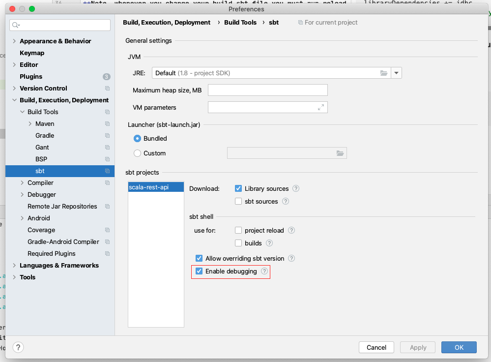
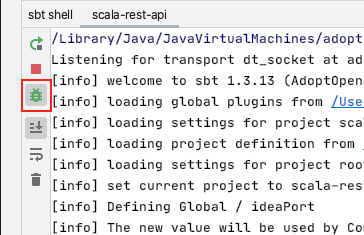

# Scala Rest API

### Prerequisites:
* Install Docker
* Install Scala
* Install SBT

### Create a new play application 

`sbt new playframework/play-scala-seed.g8`

### Running and debugging your program

To run your program type `~run [port]`. Default port is 9000.


Open [http://localhost:9000](http://localhost:9000) to view your program.

Stop the program by pressing the red stop button. Pressing enter to stop the program causes the process to carry on running in the background.

To enable debugging in IntelliJ you must set Enable debugging to true.



To enable breakpoints make sure the little debug icon above is selected.



### Setup a database 

Here is the Docker Compose file:

```yaml
version: '3.1'
services:
  db:
    image: postgres
    restart: always
    ports:
      - "5432:5432"
    environment:
      POSTGRES_PASSWORD: example
```

Start the database: `docker-compose -f docker-compose.yaml up -d`

Add database dependencies to your build.sbt file:

```scala
libraryDependencies += guice
libraryDependencies += "org.scalatestplus.play" %% "scalatestplus-play" % "5.0.0" % Test
libraryDependencies += "org.postgresql" % "postgresql" % "42.2.1"
libraryDependencies += jdbc
libraryDependencies += "org.playframework.anorm" %% "anorm" % "2.6.4"
```

**Note, whenever you change your build.sbt file you must run reload in sbt.**

### Reading from the database

First create a model class.

```scala
package models

import anorm.{Macro, RowParser}

case class Person(
                   id: Long,
                   firstName: String,
                   lastName: String,
                   email: String,
                   gender: String,
                   ipAddress: String
                 )

object Person {
  /**
   * Note the use of indexedParser here. This is because the class
   * fields are in the same sequence as the table fields but thier
   * names are not the same (firstName != first_name).
   */
  val parser: RowParser[Person] = Macro.indexedParser[Person]
}
```

Then create a controller action to read the data from the database and return as JSON.

```scala
package controllers

import javax.inject._
import play.api.mvc._
import anorm._
import play.api.db.Database
import play.api.libs.json._
import models.Person

@Singleton
class PersonController @Inject()(val controllerComponents: ControllerComponents, db: Database) extends BaseController {

  // This writer is used implicitly by the Json.toJson calls below.
  implicit val personWrites = Json.writes[Person]

  def index(id: Long) = Action { implicit request: Request[AnyContent] =>
    db.withConnection { implicit c =>
      val person = SQL"select * from people where id = ${id}".as(Person.parser.singleOpt)
      Ok(Json.toJson(person)).withHeaders(("Content-Type", "application/json"))
    }
  }

  def list(offset: Int, limit: Int) = Action { implicit request: Request[AnyContent] =>
    db.withConnection { implicit c =>
      val people = SQL"select * from people limit ${limit} offset ${offset}".as(Person.parser.*)
      Ok(Json.toJson(people)).withHeaders(("Content-Type", "application/json"))
    }
  }

}
```